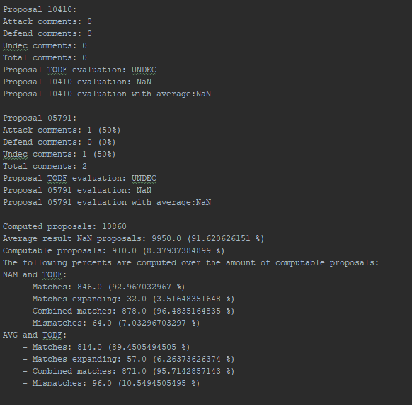

# TODF-Argumentation
Marc Fernández Font (markiff@gmail.com), in collaboration with [Maite López](http://www.maia.ub.es/~maite/) and Marc Serramià (marcserr@iiia.csic.es).
## Overview
This python based repository is an update of the aggregation functions library[1] that allow to make collective decisions in argumentation-based debates. The updates allow you to use networkx v2 and outputs a proper graphic representation.

It implements the aggregation functions defined in the following paper:

**J. Ganzer-Ripoll, Natalia Criado, Maite López-Sánchez, Simon Parsons, Juan A. Rodríguez-Aguilar. COMBINING SOCIAL CHOICE THEORY AND ARGUMENTATION: ENABLING COLLECTIVE DECISION MAKING. Group Decision and Negotiation. Springer. 2018**
(https://link.springer.com/article/10.1007/s10726-018-9594-6)

And then compares its result with the one obtained with another aggregation functions defined in the following paper:

**Aggregation operators to compute norm support in virtual communities. Marc Serramia (University of Barcelona), Maite Lopez-Sánchez (University of Barcelona) and Juan A. Rodríguez-Aguilar (IIIA-CSIC)** 
(http://www.mpref-2016.preflib.org/wp-content/uploads/2016/06/paper-12.pdf)

It uses Decidim Barcelona[2] comments as input data.

## Usage

The comparison of average, PAM and TODF methods is performed in two stages. The first stage provides the result of the comparison between average and PAM and the output from this first stage is used to compare it with TODF in the second stage (the one in this code). Hence:

First we require the file “output.txt” from the PAM comment evaluator[3], to obtain it simply download the code and run JSONEvaluator.java which will produce the file. You can find extended explanations on the functionality of the code as well as the interpretation of results in its documentation. 

Once we have obtained the output file of the first phase, there are two ways we can use this project's code: 

<h4>1. If you want to compute just one proposal and see it's output graph run</h4>

* python example.py path proposal proposal_num_files

>e.g. 'python example.py ~/metadecidim-master/comments 00050 1'

As you can see, there are different colours for nodes and edges. This correspond to the representation of the labels that both nodes and edges can have (as explained in the paper).

    Nodes:
    - Red -> OUT
    - Green -> IN
    - Yellow -> UNDEC

    Edges:
    - Red -> Attacking
    - Green -> Defending

<h4>2. If you want to compute all the comment files from a directory and get the two output files with
 some information about all computed proposals and the greater mismatches run compared with the output.txt mentioned before.</h4>

* python example.py path

>e.g. 'python example.py ~/metadecidim-master/comments'

## Requirements
Only python 2 is required

## Sources
[1] Argumentation for Collective Decision Making library from Juan A. Rodriguez-Aguilar (jar@iiia.csic.es):

https://bitbucket.org/jariiia/argumentation-for-collective-decision-making

[2] Decidim Barcelona comments data:

https://github.com/elaragon/metadecidim

[3] PAM-output is the output.txt file from commentevaluator created by Marc Serramià Amorós (marcserr@iiia.csic.es):

https://bitbucket.org/marcserr/commentevaluator

