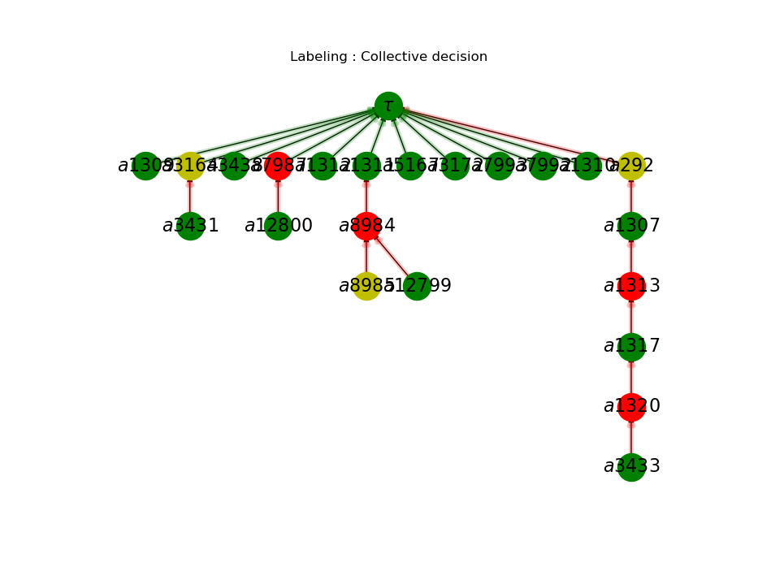

# TODF-Argumentation
## Overview
This repository is an implementation of a family of aggregation functions that allow to make collective decisions in argumentation-based debates. over Decidim Barcelona comments.

The paper implements the aggregation functions defined in the following paper:

**J. Ganzer-Ripoll, Natalia Criado, Maite López-Sánchez, Simon Parsons, Juan A. Rodríguez-Aguilar. COMBINING SOCIAL CHOICE THEORY AND ARGUMENTATION: ENABLING COLLECTIVE DECISION MAKING. Group Decision and Negotiation. Springer. 2018**

## Usage

There are two ways to run the main file:
1. If you want to compute all the comment files from a directory and get the two output files with
 some information about all computed proposals run 

* python example.py path

2. If you want to compute just one proposal and see it's output graph run

* python example.py path proposal proposal_num_files

## Requirements
Only python 2 is required

## Sources
Argumentation for Collective Decision Making library from Juan A. Rodriguez-Aguilar (jar@iiia.csic.es)

https://bitbucket.org/jariiia/argumentation-for-collective-decision-making

Decidim Barcelona comments data

https://github.com/elaragon/metadecidim
